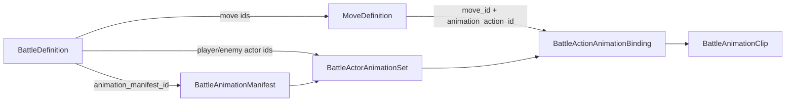

# BattleAnimationManifest Schema

> **Status**: Required architecture addendum
> **Date**: 2026-05-26
> **Primary ADR**: `docs/architecture/adr-0007-battle-runtime-state-machine.md`
> **Depends on**: ADR-0004 Authored Content Resources, ADR-0015 Audio Event Routing And Mix Ownership
> **Source evidence**: `design/art/battle-animation-coverage.md`; vertical slice Revision 4S

## Purpose

`BattleAnimationManifest` is the authored presentation contract that binds combat logic content to battle sprites and VFX. It prevents `MoveDefinition` and `BattleDefinition` Resources from being implemented with generic or missing animation branches.

The manifest is presentation-only. It never affects damage, accuracy, status resolution, rewards, AI choice, save data, or durable battle settlement.

## Resource Relationship



`MoveDefinition` remains logic-owned authored content. It may expose stable presentation IDs, but it must not contain sprite paths.

`BattleDefinition` selects which animation manifest applies to the encounter and which actor animation sets are legal for the player, enemy, support actors, and boss phase profiles.

`BattleAnimationManifest` owns sprite/VFX asset references and validates that every required move/action used by the battle has a matching clip.

## Typed Resource Shapes

These snippets define the implementation shape. Exact file names may change, but field names and validation semantics should remain stable.

```gdscript
class_name BattleAnimationManifest
extends Resource

@export var manifest_id: StringName
@export var schema_version: int = 1
@export var actor_sets: Array[BattleActorAnimationSet] = []
@export var global_clips: Array[BattleAnimationClip] = []
@export var reduced_motion_profile_id: StringName
@export var fallback_policy: StringName = &"content_lock_error"
@export var notes: String = ""
```

```gdscript
class_name BattleActorAnimationSet
extends Resource

@export var actor_id: StringName
@export var actor_kind: StringName
@export var element: StringName
@export var stage_id: StringName
@export var variant_id: StringName
@export var facing: StringName = &"right"
@export var frame_slot_size: Vector2i
@export var anchor: Vector2
@export var idle_clip_id: StringName
@export var telegraph_clip_id: StringName
@export var hurt_clip_id: StringName
@export var defend_start_clip_id: StringName
@export var defend_hit_clip_id: StringName
@export var ko_clip_id: StringName
@export var victory_settle_clip_id: StringName
@export var action_bindings: Array[BattleActionAnimationBinding] = []
```

`actor_kind` must be one of:

```text
dragon, npc_dragon, support_enemy, boss, mirror_admin_phase
```

`variant_id` is optional and supports shiny, Elder, corruption, boss phase, or authored skin variants. If blank, the set is the default for that actor/element/stage.

```gdscript
class_name BattleActionAnimationBinding
extends Resource

@export var binding_id: StringName
@export var move_id: StringName
@export var animation_action_id: StringName
@export var action_class: StringName
@export var clip_id: StringName
@export var impact_frame_index: int = -1
@export var vfx_clip_id: StringName
@export var receive_clip_id: StringName
@export var presentation_event_id: StringName
@export var allowed_fallback_clip_id: StringName
@export var coverage_status: StringName = &"required"
```

`action_class` must be one of:

```text
basic_attack, heavy_attack, status_move, defend, counter, consumable, hurt, ko, boss_special
```

`coverage_status` must be one of:

```text
required, approved, prototype, placeholder, blocked
```

Only `approved` and explicitly accepted `prototype` bindings can pass production content lock. `placeholder` is legal for greybox and vertical-slice work only.

```gdscript
class_name BattleAnimationClip
extends Resource

@export var clip_id: StringName
@export var asset_path: String
@export var frame_count: int
@export var frame_duration_ms: int
@export var frame_paths: PackedStringArray = []
@export var loop: bool = false
@export var anchor: Vector2
@export var slot_size: Vector2i
@export var playback_mode: StringName = &"strip"
@export var reduced_motion_clip_id: StringName
@export var preview_sheet_path: String
@export var runtime_capture_paths: PackedStringArray = []
@export var approval_status: StringName = &"prototype"
@export var accessibility_notes: String = ""
```

`playback_mode` must be one of:

```text
strip, frame_sequence, vfx_overlay, actor_overlay
```

## MoveDefinition Additions

`MoveDefinition` must expose the IDs needed to bind logic to presentation without owning art files:

```gdscript
@export var move_id: StringName
@export var element: StringName
@export var move_kind: StringName
@export var status_id: StringName
@export var animation_action_id: StringName
@export var required_animation_class: StringName
@export var presentation_profile_id: StringName
```

Rules:

- `move_id` is the canonical binding key for authored move-specific strips.
- `animation_action_id` allows multiple moves to share a family only when art direction explicitly approves it, such as two NPC variants using one `stone_slam` family. Sharing must be visible in the manifest and cannot be hidden in code.
- `required_animation_class` drives content validation. A status move cannot bind to a basic attack clip.
- `presentation_profile_id` may drive Audio Director / UI presentation routing, but the move still requires an animation binding.
- `MoveDefinition` must not reference Texture, PNG, sprite-sheet, or VFX file paths.

## BattleDefinition Additions

`BattleDefinition` must select the animation manifest and the actor animation sets required by the encounter:

```gdscript
@export var battle_id: StringName
@export var move_ids: Array[StringName]
@export var enemy_move_ids: Array[StringName]
@export var support_actor_ids: Array[StringName]
@export var animation_manifest_id: StringName
@export var player_actor_animation_selector: StringName
@export var player_actor_animation_set_id: StringName
@export var enemy_actor_animation_set_id: StringName
@export var support_actor_animation_set_ids: Array[StringName]
@export var boss_phase_animation_set_ids: Array[StringName]
```

Rules:

- Campaign Map and Singularity encounter Resources must provide a valid `animation_manifest_id`.
- Standard player battles use `player_actor_animation_selector` to resolve the active dragon by `dragon_id`, `element`, `stage_id`, and `variant_id`.
- Validation consumes the resolved `player_actor_animation_set_id`; content build tools may populate it directly for fixed encounters or after applying `player_actor_animation_selector`.
- Fixed enemy encounters use `enemy_actor_animation_set_id`.
- Support actors only need action bindings if they can act, telegraph, receive hits, or create VFX. Passive background-only actors can use an idle-only set marked `presentation_only`.
- Mirror Admin phase profiles must list a phase-specific actor set when the silhouette, palette, or action loop changes by phase.

## Runtime Lookup

At battle INIT, the Battle presentation layer resolves animation content once:

```gdscript
func resolve_action_clip(
    manifest: BattleAnimationManifest,
    actor_set_id: StringName,
    move: MoveDefinition
) -> BattleActionAnimationBinding
```

Lookup order:

1. Find actor set by `actor_id` / `element` / `stage_id` / `variant_id`.
2. Find binding with exact `move_id`.
3. If no exact move binding exists, find binding with matching `animation_action_id`.
4. Validate `action_class == move.required_animation_class`.
5. Validate clip, optional VFX clip, receive clip, preview sheet, and runtime capture evidence.
6. If unresolved and `fallback_policy == "content_lock_error"`, fail content validation before battle can ship.

Runtime code must not branch on move names to choose sprite paths. The only runtime choice is manifest lookup by stable IDs.

## Validation Contract

Content validation must run at boot or content-lock time and return a named result, not an anonymous dictionary:

```gdscript
class_name BattleAnimationValidationResult
extends RefCounted

var ok: bool
var manifest_id: StringName
var manifest_id_mismatches: PackedStringArray
var missing_actor_sets: Array[StringName]
var missing_base_clips: Array[StringName]
var missing_move_bindings: Array[StringName]
var wrong_action_class_bindings: Array[StringName]
var placeholder_bindings: Array[StringName]
var missing_clip_assets: PackedStringArray
var missing_preview_evidence: PackedStringArray
var missing_runtime_capture_evidence: PackedStringArray
var accessibility_warnings: PackedStringArray
```

Validation rules:

- Every `BattleDefinition.animation_manifest_id` resolves to one manifest.
- A `BattleDefinition.animation_manifest_id` / `BattleAnimationManifest.manifest_id` mismatch is reported as a manifest mismatch, not as a missing clip.
- Every `BattleDefinition` actor set ID resolves inside that manifest.
- Every battle-capable actor set has non-empty base clip IDs for idle, telegraph, hurt, defend-start, defend-hit, and KO.
- Every move in `move_ids`, `enemy_move_ids`, `BossDefinition`, and `MirrorAdminPhaseProfile.scripted_loop` resolves to a binding for the acting actor.
- Defend, hurt, defend-hit, KO, and status-receive clips are validated even when they are not listed as moves.
- Required assets exist and match declared frame count, slot size, anchor policy, and transparency expectations.
- `frame_sequence` clips must list one existing file per declared frame in `frame_paths`.
- `placeholder` bindings fail production content lock unless the story explicitly declares greybox scope.
- VFX overlays must include accessibility notes for color-independent readability and reduced-motion behavior.
- Runtime screenshot evidence is required before a combat encounter can be visually accepted.

## Ownership Boundaries

Battle Engine:

- Reads `BattleAnimationManifest` and emits presentation events.
- Does not mutate manifest Resources.
- Does not use animation completion as a gameplay timing authority unless the Battle UX spec later accepts a presentation-blocking rule.
- Does not change damage, status, AI, or settlement based on animation data.

Battle UI / presentation adapter:

- Plays clips, VFX overlays, hit flashes, and reduced-motion substitutions.
- Maps Battle runtime payloads to actor/action animation bindings.
- Keeps HP bars, TELEGRAPH markers, and input prompts above or clear of VFX.

Audio Director:

- May consume `presentation_event_id` or Battle presentation payloads.
- Owns audio cue selection and playback.
- Must not depend on animation playback completion for gameplay.

Content Registry / validation:

- Loads manifests and validates cross-resource IDs.
- Rejects missing or placeholder production bindings before content lock.

## Prototype Mapping

The current vertical slice uses prototype-local filenames, but maps cleanly onto the schema:

| Actor | Move / Action | Binding |
|---|---|---|
| `root_wyrmling` | `root_spark` | `root_spark_attack_battle_*`, `vfx_root_spark` |
| `root_wyrmling` | `thorn_surge` | `thorn_surge_attack_battle_*`, `vfx_thorn_surge` |
| `root_wyrmling` | `battle_defend` / Guarded Spark | `guarded_spark_attack_battle_*`, `vfx_guarded_spark` |
| `admin_protocol` | `data_leak` | `enemy_data_leak_*`, `vfx_shadow_burst` |

Production should migrate these into the actor/action directory pattern from `design/art/battle-animation-coverage.md`.

## Initial Implementation

The first production-facing Resource implementation lives under `src/battle/`:

- `src/battle/animation/battle_animation_manifest.gd`
- `src/battle/animation/battle_actor_animation_set.gd`
- `src/battle/animation/battle_action_animation_binding.gd`
- `src/battle/animation/battle_animation_clip.gd`
- `src/battle/animation/battle_animation_manifest_validator.gd`
- `src/battle/animation/battle_animation_validation_result.gd`
- `src/battle/data/move_definition.gd`
- `src/battle/data/battle_definition.gd`

GUT coverage lives at `tests/unit/battle/test_battle_animation_manifest_validator.gd` and verifies successful move binding, missing bindings, action-class mismatches, placeholder production-lock failure, manifest-ID mismatch reporting, missing preview evidence, and missing required base reaction clips.

The first authored content fixture lives under `assets/battle/`:

- `assets/battle/animation_manifests/root_wyrmling_vs_admin_protocol.tres`
- `assets/battle/battles/village_edge_admin_protocol.tres`
- `assets/battle/moves/root_spark.tres`
- `assets/battle/moves/thorn_surge.tres`
- `assets/battle/moves/guarded_spark.tres`
- `assets/battle/moves/data_leak.tres`

Integration coverage lives at `tests/integration/battle/test_root_admin_animation_content.gd` and loads the real `.tres` files, frame-sequence sprites, preview sheets, VFX, and runtime captures before running `BattleAnimationManifestValidator`.

The standalone vertical slice mirrors the fixture under `prototypes/dragon-forge-vertical-slice/assets/battle/` and resolves draw keys from that manifest at runtime. The prototype mirror deliberately uses local scripts without global `class_name`s so the root Godot project keeps a single canonical production class set under `src/battle/`.
