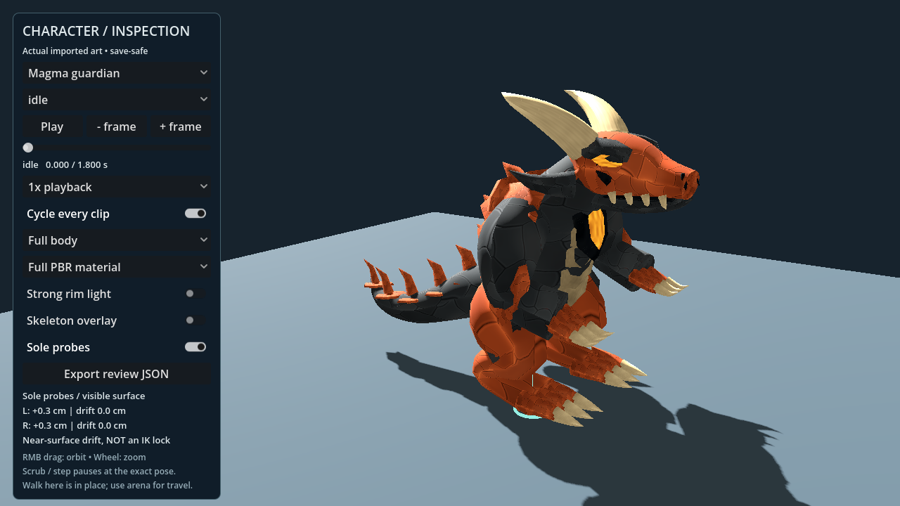
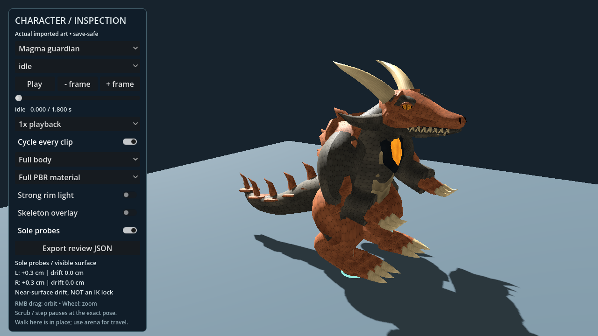
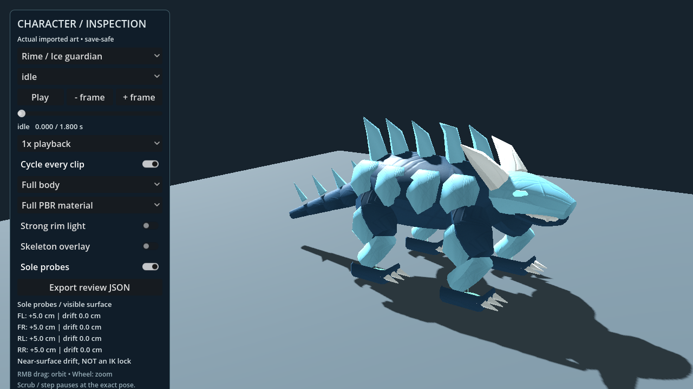
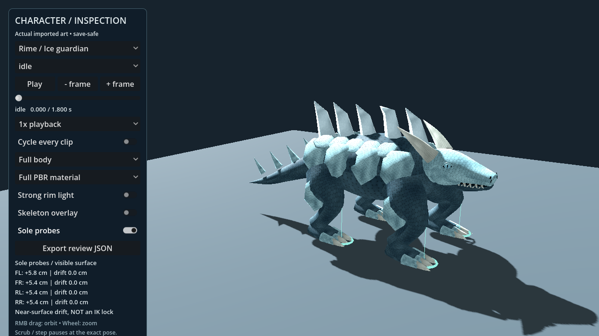
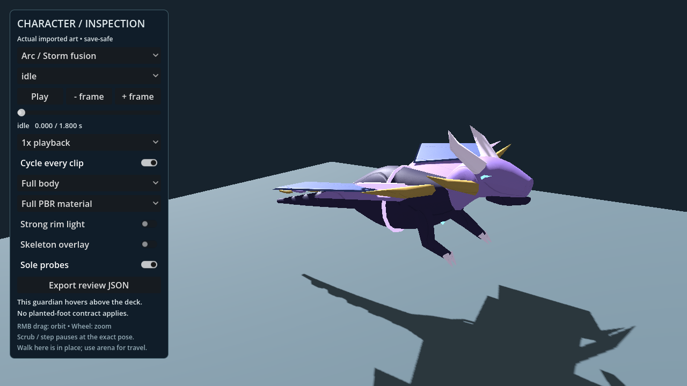
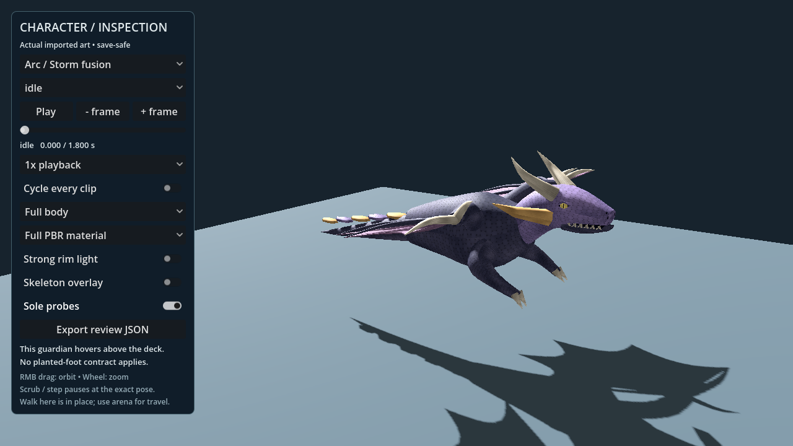
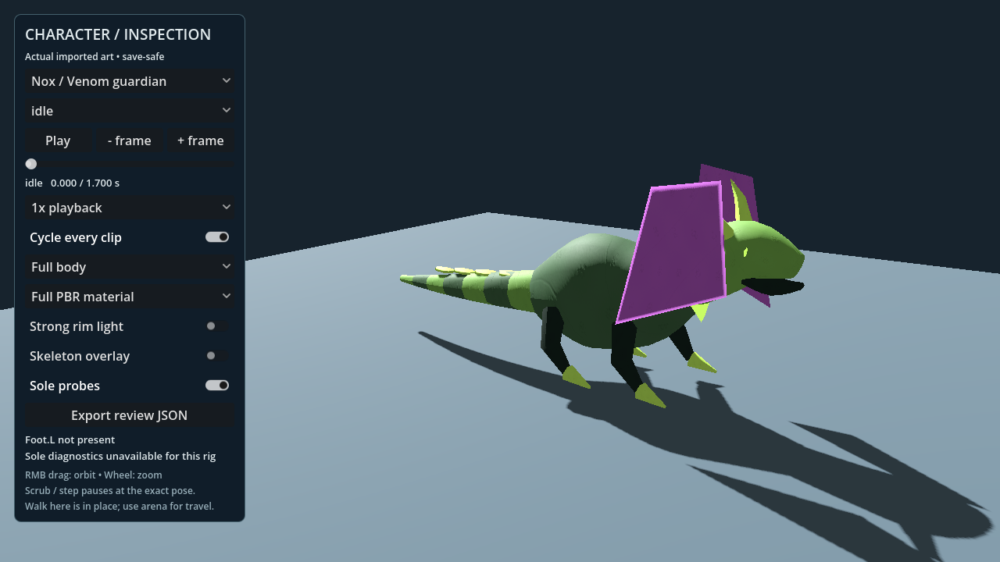
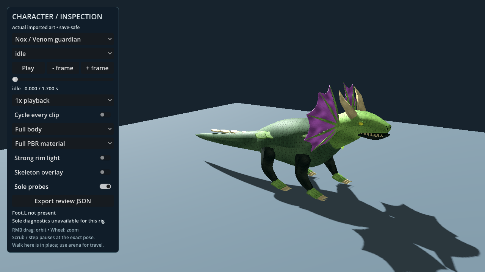

# Dragon realism comparison

These are renders of the actual Godot assets, captured from the existing character
inspector under the same neutral key light, camera and idle time. The rim light is
disabled in both columns. They are not concept illustrations.

| Guardian | Before | Revised |
| --- | --- | --- |
| Magma / Fire |  |  |
| Rime / Ice |  |  |
| Arc / Storm |  |  |
| Nox / Venom |  |  |

Fire, Ice and Storm evolutions inherit their revised parent geometry and animation.
The other five guardian identities are outside this creature pass. See the
[art and motion notes](../../../dragon-forge-nextgen/art/REALISM.md) for scope,
rebuilding, validation scenes, and the remaining human review.

`evidence.json` records the baseline revision and hashes of both sets' source asset
manifests. The full 52-view capture run covers every clip and the production game
camera; CI publishes both OpenGL and Forward+ evidence with the tested revision.
